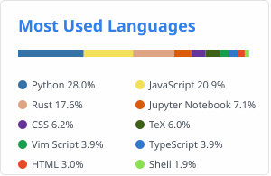

# neostats



#### A rust cli based alternative to [GitHub Readme Stats](https://github.com/anuraghazra/github-readme-stats)

## Features

- Fetches language data from all non-fork repositories for a GitHub user
- Generates a clean SVG visualization showing the top 10 most used languages
- Can save/load language data to/from YAML files for offline use
- Uses official [GitHub Linguist](https://github.com/github-linguist/linguist) colors

## Installation

```bash
cargo install --path .
```

## Usage

Generate an SVG for a GitHub user:
```bash
neostats <username> --svg stats.svg
```

Save language data to YAML:
```bash
neostats <username> --out stats.yaml
```

Load from existing YAML data (offline mode):
```bash
neostats <username> --in stats.yaml --svg stats.svg
```

Apply a different SVG theme (defaults to `light`):
```bash
neostats <username> --theme dark
```

Custom themes can be added under `themes/` as YAML files. Pass the theme name (without the `.yaml` extension) or a direct path to apply it.